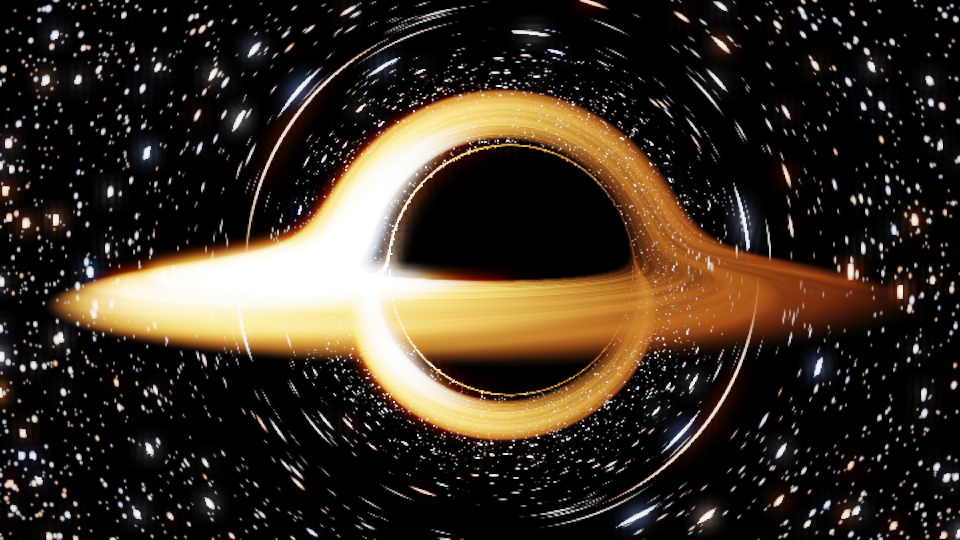
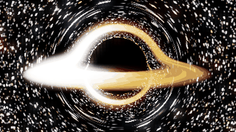
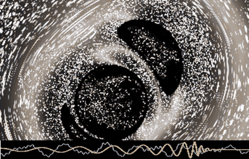
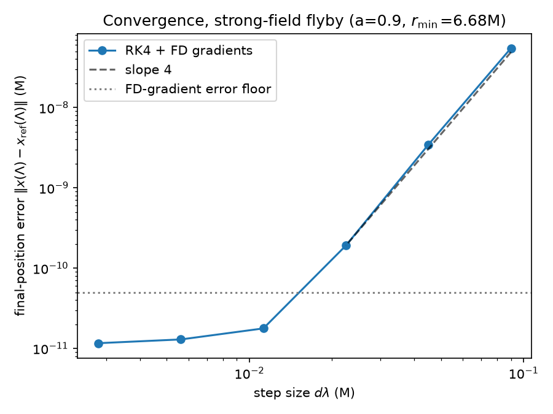
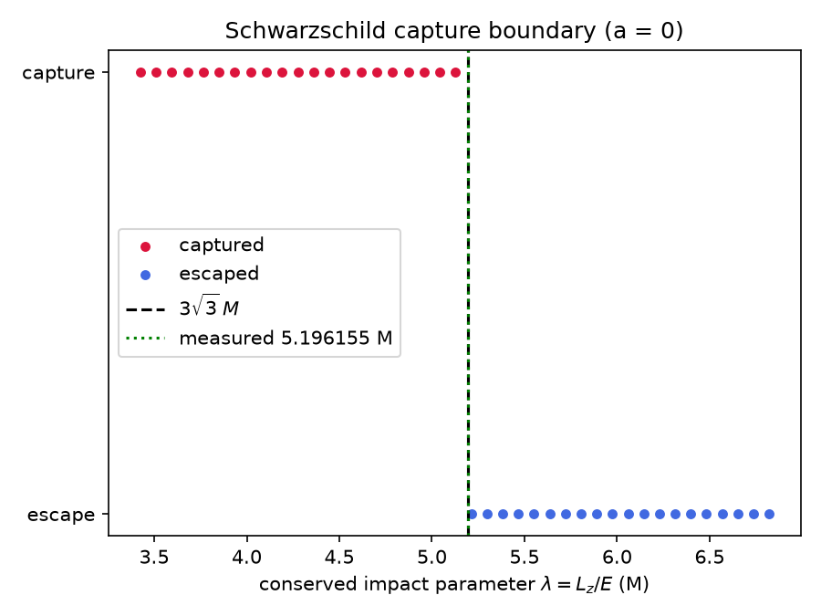
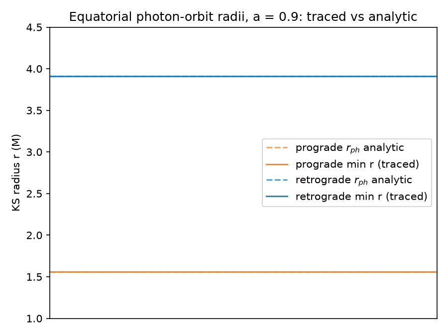
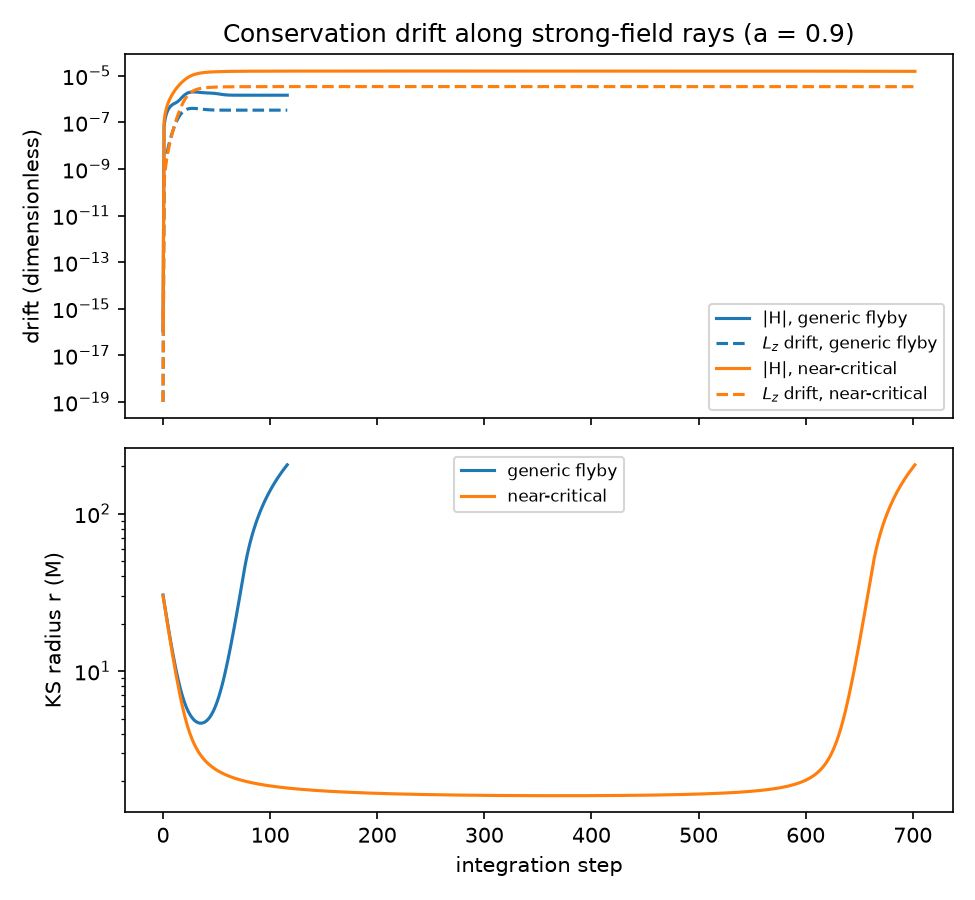

# Kerr Black Hole Ray Tracer

A browser-based, real-time, interactive black hole renderer. Every pixel is
computed by numerically integrating a **null geodesic of the Kerr metric**
in a WebGL2 fragment shader — the light bending, frame dragging, disk
Doppler/redshift, and shadow are all exact solutions of general relativity,
not approximations or artistic effects.

**[Live demo](https://kyleyhw.github.io/black_hole/)** · spin slider from
Schwarzschild (a = 0) to near-extremal (a = 0.998 M), free orbit camera
plus a **free-fall camera on a timelike geodesic** (with per-pixel
aberration and sky red/blueshift from a proper camera tetrad),
relativistic accretion disk (prograde/retrograde, tiltable), a clearly
labeled linearized **multi-mass mode** with draggable masses, a
**binary-merger mode** that replays real LIGO/GWTC events with a
model-synthesized gravitational-wave chirp, a WebGPU progressive HQ-still
renderer (WebGL2 remains the universal fallback), a procedural starfield,
and a 12-check validation suite.



*a/M sweep 0 → 0.998 — watch the shadow go asymmetric and the ISCO walk
inward:*



---

## The physics

The metric is used in **Kerr–Schild (Cartesian) form**,

$$g_{\mu\nu} = \eta_{\mu\nu} + f\, l_\mu l_\nu, \qquad
f = \frac{2 M r^3}{r^4 + a^2 z^2}, \qquad
g^{\mu\nu} = \eta^{\mu\nu} - f\, l^\mu l^\nu \ \text{(exact, } l \text{ null)},$$

with $r$ the Kerr–Schild radius, $r^4 - r^2(\rho^2{-}a^2) - a^2z^2 = 0$.
Why Kerr–Schild over Boyer–Lindquist: it is horizon-penetrating (no
coordinate singularity at $r_+$), regular on the polar axis, and needs no
turning-point bookkeeping — fewer branches, fewer bugs, cleaner shader.
Rays follow Hamilton's equations for $H = \tfrac12 g^{\mu\nu}(x)p_\mu p_\nu$,
so no Christoffel symbols appear anywhere, and $H \approx 0$ doubles as a
per-ray error monitor you can render (debug views).

The accretion disk is matter on circular equatorial geodesics between
$r_{\rm ISCO}(a)$ (Bardeen–Press–Teukolsky, live in the UI) and a chosen
outer edge. Its shading uses the exact redshift factor

$$g = \frac{1}{u^t\,(1 - \Omega \lambda)}, \qquad
\lambda = \frac{L_z}{E}, \qquad
\Omega = \frac{\sqrt{M}}{r^{3/2} + a\sqrt{M}}, \qquad
u^t = \frac{1 + a\sqrt{M}/r^{3/2}}{\sqrt{1 - 3M/r + 2a\sqrt{M}/r^{3/2}}},$$

which packages gravitational redshift, orbital Doppler beaming
(intensity $\propto g^4$), and frame dragging in one conserved-quantity
expression. Everything rendered is exact GR; the deliberate exceptions
(schematic overlays, the starfield's magnification artifact) are labeled as
such in the docs. Full derivations: [docs/derivations.md](docs/derivations.md).

The mass "slider" is a pure display rescale — $M$ is scale-free in
geometrized units, which is itself the physics: the readouts convert
$r_+$ and $r_{\rm ISCO}$ to km/au for your chosen mass.

## Binary mergers (LIGO/GWTC events)

Merger mode replays **real LIGO/Virgo detections** — GW150914 and five
others, with their published source-frame masses and spins ([GWTC-2.1][6])
— as a cinematic inspiral → plunge → ringdown, with the gravitational-wave
**chirp synthesized from the same model** and played at true rate.



The two holes are rendered with a **superposed Kerr–Schild metric**,

$$g_{\mu\nu} = \eta_{\mu\nu} + f_1\, l^{(1)}_\mu l^{(1)}_\nu
  + f_2\, l^{(2)}_\mu l^{(2)}_\nu,$$

each term a *boosted* Kerr–Schild hole at its instantaneous orbital
position and velocity. Because each $l^{(i)}$ is null, the inverse stays
**closed-form** via two successive Sherman–Morrison rank-1 updates — no
matrix is inverted in the shader — and light is integrated through it
**exactly**, so the inter-hole lensing (each shadow deformed and multiply
imaged by its companion) is a real geodesic effect. The orbit follows a
**TaylorT4** post-Newtonian evolution (3.5PN non-spinning + 1.5PN
spin–orbit), bridged through the plunge to the remnant by a $C^1$ blend,
which then rings down on its dominant **(2,2,0) quasi-normal mode**. The
audio is the restricted-PN strain $h \propto M^{5/3} f^{2/3}\cos 2\varphi$
built from the *same* phase track that drives the picture, so sound and
image are phase-locked; near merger the orbital frequency exceeds 100 Hz, so
the visuals run in slow motion while the chirp plays at true rate, timed to
land its merger instant on the visual one. Every rung of this construction
is a labeled approximation — see below, and
[docs/derivations.md §12–13](docs/derivations.md). Adding an event is one
JSON entry ([`src/gwevents.json`](src/gwevents.json)); each ships with the
catalog DOI.

## What's physical and what isn't

**Exact GR.** All light propagation in Kerr mode: every pixel is a
numerically integrated null geodesic, so the shadow, *all* lensing —
including the lensing of the background (Einstein-ring streaking, multiple
imaging near the photon shell) — frame dragging, and aberration are the
real thing. So are the camera model (proper tetrad angles; the free-fall
camera rides a true timelike geodesic), the sky's per-pixel red/blueshift,
the disk's orbital kinematics and its full redshift factor
(gravitational + Doppler + frame dragging) with $g^4$ beaming, the live
ISCO inner edge, and the mass rescaling.

**Physically structured, stylistically dressed.** The background *pattern*
is not a star catalog — stars are procedurally placed with plausible
brightness/temperature distributions; their *deflection* is exact, but
*where* a star sits is invented. The disk's emissivity profile is
Novikov–Thorne-like, its colors come from a compact blackbody ramp, and its
turbulent texture is value noise (advected at the true per-annulus
Keplerian rate) — the structure of the shading is physics, the detailing is
aesthetic. ACES tonemapping and bloom are display choices: colors are not
spectrophotometric predictions.

**Approximations, labeled in-app.** The star renderer does not conserve
surface brightness under magnification (lensed streaks render brighter
than physical — doing it right needs magnification-tensor filtering, cf.
the DNGR paper). The tilted disk at $a \neq 0$ is a kinematic
approximation (closed circular orbits off the equator don't exist in
Kerr); it is exact at $a = 0$, and light propagation stays exact
regardless. The multi-mass mode is *linearized* gravity with a validity
meter — its "capture" spheres regularize a broken approximation, they are
not horizons. The ergosphere/photon-ring overlays are schematic markers
drawn without lensing, deliberately. Rays that exhaust the step budget
(photon-shell strugglers) render as shadow.

**Merger mode — an honesty ladder.** The binary feature stacks five
approximations, each honest about where it stops:

1. **Metric — controlled, light transport exact.** The superposed
   Kerr–Schild sum is exact for each hole alone; its cross-term error is
   $\mathcal{O}(M_1 M_2/d)$ at separation $d$ (the same construction NR uses
   for binary initial data). Given the metric, *light is integrated
   exactly* — the lensing you see is real. The single-hole limit
   $M_2\to0$ reduces to the exact Kerr inverse to machine precision (the
   anchor validation, $4{\times}10^{-16}$).
2. **Orbit — post-Newtonian.** TaylorT4 is an expansion in $v/c$: trustworthy
   while the holes are well separated, degrading as they approach. The early
   chirp rate is set by the **chirp mass**
   $\mathcal{M}=(M_1M_2)^{3/5}/(M_1{+}M_2)^{1/5}$, not the total mass.
3. **Plunge — schematic.** From the ISCO inward, PN is invalid; a short
   $C^1$ Hermite blend bridges to the remnant. It is continuous in value and
   slope but *not* a solution of the field equations — true plunge dynamics
   need numerical relativity.
4. **Ringdown — dominant mode only.** A single damped (2,2,0) quasi-normal
   mode (Berti–Cardoso–Will fits); the real signal is a sum over overtones.
5. **Time & sound — remapped, phase-locked.** Visuals are slowed (default
   ×25) while the chirp plays at true rate; the optional pitch shift is a
   labeled cosmetic octave transposition, as in LIGO's own released audio.

**Transport caveat (with an opt-in fix).** The binary metric is
time-dependent, so $p_t$ is no longer exactly conserved. By default,
rendering uses the **frozen-metric** (per-frame snapshot) approximation —
standard for real-time black-hole visualization. A **retarded-transport**
toggle (Merger panel) instead integrates $(t, p_t)$ along each ray and lets
the holes ride their circular worldlines, so light passing one hole finds the
other where it *actually was* — a real, growing-toward-merger effect that
reduces bit-for-bit to the frozen image in the static limit (see
[docs/derivations.md §14](docs/derivations.md) and
[e2e/reports/phase16.md](e2e/reports/phase16.md)). Every rung above is also
spelled out in the in-app ⓘ popups.

## The numerics

RK4 integration of Hamilton's equations with central-difference gradients
of $H$ (6 extra metric evaluations per step — nothing hand-derived to get
wrong), a displacement-bounded adaptive step
$d\lambda = 0.1\,\min(r - 0.9 r_H,\, r)/|dx/d\lambda|$, and termination by
horizon capture, escape, or blueshift blow-up ($|p|^2 > 10^8$ — a
past-directed shadow ray hugs the horizon with exponentially growing
momentum; catching it is both physically meaningful and what keeps f32
alive). The FD step $\varepsilon = 2{\times}10^{-3}\max(r,1)$ comes from an
explicit f32 truncation/roundoff optimum. Details:
[docs/numerics.md](docs/numerics.md).

## Validation

A float64 mirror of the exact shader algorithm
([`validation/kerr.py`](validation/kerr.py)) is tested against analytic
strong-field results — all 20 checks pass
([full report](validation/reports/validation.md)):

| | |
|---|---|
|  |  |
| **Convergence:** global error vs step size on a strong-field flyby; the points ride the slope-4 line until the finite-difference-gradient floor (annotated) — the scheme is genuinely 4th order (measured 4.08). | **Schwarzschild capture boundary:** bisection on capture/escape recovers the critical impact parameter to 5×10⁻⁷ relative: measured 5.196155 M vs 3√3 = 5.196152 M. |
|  |  |
| **Kerr photon shell (a = 0.9):** the marginally-escaping ray's minimum radius matches the analytic prograde/retrograde photon-orbit radii to ~10⁻⁵ — frame dragging quantitatively right, both senses. | **Conservation drift:** E is conserved identically by construction; L_z and H stay bounded at ~10⁻⁶ (production stepping) on a generic flyby and <2×10⁻⁵ on a near-critical ray that winds the photon shell, where instability amplifies error by ~e^{2π} per orbit. |

Four more studies validate the extended features:
**free fall vs the Schwarzschild cycloid** (the timelike Hamiltonian
branch: max relative error 7×10⁻¹⁰ over 44,711 proper-time steps,
`validation/plots/freefall_cycloid.png`), **weak-field deflection**
(α = 4M/b to 0.28% at b = 10³ M with log–log slope −1.008, two-mass
far-field additivity to 3.3%, `validation/plots/weakfield_deflection.png`),
and the merger mode: **PN chirp + ringdown**
(TaylorT4 reproduces the analytic 0PN chirp time to 3×10⁻⁹ and GW150914's
published ringdown, 249 Hz / 4.1 ms, `validation/plots/pn_chirp.png`) and
the **superposed Kerr–Schild binary metric** (Sherman–Morrison inverse
exact to 4×10⁻¹⁶, single-hole limit at the expected first-order rate,
far-field additivity to 0.4%, `validation/plots/superposed_ks.png`). The
in-browser suite additionally cross-checks the TypeScript TaylorT4 driver
against the Python reference and FFT-verifies that the synthesized audio's
frequency sweep matches the same evolution.

**In-browser cross-check:** the rendered Schwarzschild shadow radius at
r₀ = 18 M matches the textbook local-frame prediction
sin θ = (3√3M/r₀)√(1−2M/r₀) to **0.006%** (44.094 px vs 44.091 px) with
the tetrad camera — and, before the tetrad refactor, matched the
*coordinate-camera* prediction (37.27 px, an 18% different number derived
in [docs/derivations.md](docs/derivations.md) §4) to 0.13%: the same
integrator hitting each camera convention's own analytic answer. See
[e2e/reports/phase8.md](e2e/reports/phase8.md).

## Rendering

Thin-disk shading (bisected geodesic hits, $g^4$ beaming, blackbody ramp at
$g\,T(r)$, differentially-rotating 3-octave noise, semi-transparent
accumulation that keeps integrating — that's where the lensed
above/below-shadow images come from), a zero-asset procedural starfield
(cube-projected hash cells; lensed streaking comes free from the geodesic
map), and an HDR pipeline: RGBA16F targets → bright-pass separable Gaussian
bloom → ACES tonemap. Details: [docs/rendering.md](docs/rendering.md).

## Controls

| Control | Action |
|---|---|
| Left-drag | orbit (azimuth/elevation, clamped ±89°) |
| Scroll / pinch | zoom, r ∈ [2.2, 60] M |
| Double-click | reset camera |
| Spin slider | a/M ∈ [0, 0.998] (Thorne limit) |
| Mass slider | display scale only — the image is scale-invariant (readouts in km/au) |
| Disk section | toggle, outer radius, exposure, g⁴ beaming toggle |
| Quality section | max integration steps, resolution scale, bloom |
| Overlays | ergosphere shell, photon-orbit rings, coordinate grid (constant-r circles every 2M + 30° spokes), debug views (step count, \|H\| drift, final r) |
| Presets | Schwarzschild · Interstellar-ish (a = 0.6) · Near-extremal (a = 0.998) |
| Screenshot | canvas → PNG download |
| Camera section | free-fall **Release** / **Stop** (timelike geodesic, frame-dragging drift visible at a > 0), sky-redshift toggle, **auto-orbit** idle drift |
| ⓘ buttons | click-to-learn popups on each section, plus a **Units & notation** glossary defining every symbol (a, φ, Ω, uᵗ, g, …) |
| Sidebar tab | collapse/show the whole control panel |
| Disk extras | retrograde flow toggle (watch the ISCO jump), tilt slider (kinematic approximation for a ≠ 0, exact at a = 0) |
| Multi-mass | linearized N-body lensing: drag masses on the canvas, per-mass sliders, pairwise-\|Φ\| validity warning |
| Merger | pick a LIGO/GWTC event → Play/Pause/Restart, slow-motion slider; true-rate chirp with volume + pitch-shift toggle; waveform bar (hideable on its own or with the sidebar) |
| HQ still | WebGPU 256-sample progressive accumulation → PNG (auto-disabled without an adapter) |

## Repository layout

```
black_hole/
├── index.html               # shell, panel styling, About modal
├── src/
│   ├── main.ts              # render pipeline (scene → bloom → composite)
│   ├── camera.ts            # orbit camera
│   ├── physics.ts           # CPU-side: r_+, r_ISCO, photon orbits
│   ├── tetrad.ts            # f64 metric ops + camera tetrad (Gram–Schmidt under g)
│   ├── geodesic.ts          # CPU timelike integrator (free-fall camera)
│   ├── merger.ts            # TaylorT4 PN driver + QNM ringdown + chirp synthesis
│   ├── gwevents.json        # curated LIGO/GWTC event catalog (with DOIs)
│   ├── webgpu.ts            # WebGPU progressive HQ-still session
│   ├── panel.ts             # control panel (hand-rolled, no widget lib)
│   ├── gl.ts                # WebGL2 boilerplate (+ #define shader variants)
│   └── shaders/
│       ├── render.frag.glsl # ALL the physics: metric, integrator, disk, stars
│       │                    #   (+ WEAK_FIELD multi-mass & BINARY merger variants)
│       ├── hq.wgsl          # WebGPU compute port, line-parallel with the GLSL
│       ├── blur.frag.glsl   # bright-pass separable Gaussian
│       ├── composite.frag.glsl # ACES tonemap + overlays
│       └── fullscreen.vert.glsl
├── validation/              # float64 mirror + analytic tests (uv project)
│   ├── kerr.py              # the integrator, line-parallel with the shader
│   ├── weakfield.py         # linearized multi-mass mirror
│   ├── pn.py                # TaylorT4 PN chirp + QNM reference (merger mode)
│   ├── superposed.py        # superposed-KS inverse + single-hole-limit check
│   ├── run_validation.py    # 4 studies → plots/ + reports/
│   ├── plots/  reports/
├── e2e/                     # Playwright browser tests, one per phase
│   ├── harness.cjs  phase*.cjs
│   ├── reports/  screenshots/
├── docs/                    # documentation (index: docs/README.md)
│   ├── derivations.md       # all the mathematics, from first principles
│   ├── numerics.md          # integrator, step control, termination, precision
│   ├── rendering.md         # disk, starfield, post-processing, overlays
│   ├── architecture.md      # software structure, tri-backend parity, testing
│   ├── validation.md        # verification philosophy + float64 mirror
│   └── img/
└── PROJECT_PLAN.md          # full technical spec + phased task tracker
```

## Documentation index

- [docs/README.md](docs/README.md) — documentation hub
- [docs/derivations.md](docs/derivations.md) — all the mathematics, from first principles
- [docs/numerics.md](docs/numerics.md) — integrator, step control, termination, precision
- [docs/rendering.md](docs/rendering.md) — disk, starfield, post-processing, overlays
- [docs/architecture.md](docs/architecture.md) — software structure, tri-backend parity, testing harness
- [docs/validation.md](docs/validation.md) — verification philosophy and the float64 mirror
- [validation/reports/validation.md](validation/reports/validation.md) — numerical validation report (per-plot interpretation)
- [e2e/reports/](e2e/reports/) — per-phase browser test reports
- [PROJECT_PLAN.md](PROJECT_PLAN.md) — specification and task tracker

## Build

```bash
npm install
npm run dev        # local dev server
npm run build      # typecheck + production build to dist/
cd validation && uv run python run_validation.py   # regenerate plots
```

Deployed to GitHub Pages by `.github/workflows/deploy.yml` on push.

## References

<span id="ref-bpt-1972">[1]</span> Bardeen, J. M., Press, W. H., & Teukolsky, S. A. (1972). *Rotating Black Holes: Locally Nonrotating Frames, Energy Extraction, and Scalar Synchrotron Radiation.* ApJ, 178, 347. [Link](https://doi.org/10.1086/151796) — circular-orbit kinematics, ISCO, photon orbits.

<span id="ref-mtw">[2]</span> Misner, C. W., Thorne, K. S., & Wheeler, J. A. (1973). *Gravitation.* W. H. Freeman. — geodesics as Hamiltonian flow; Kerr geometry.

<span id="ref-chandra">[3]</span> Chandrasekhar, S. (1983). *The Mathematical Theory of Black Holes.* Oxford University Press. — Kerr geodesics; Kerr–Schild form.

<span id="ref-dngr">[4]</span> James, O., von Tunzelmann, E., Franklin, P., & Thorne, K. S. (2015). *Gravitational lensing by spinning black holes in astrophysics, and in the movie Interstellar.* Class. Quantum Grav., 32, 065001. [Link](https://doi.org/10.1088/0264-9381/32/6/065001) — the lineage of this technique, and the correct treatment of the starfield-magnification problem this project consciously approximates.

<span id="ref-thorne-1974">[5]</span> Thorne, K. S. (1974). *Disk-Accretion onto a Black Hole. II. Evolution of the Hole.* ApJ, 191, 507. [Link](https://doi.org/10.1086/152991) — the a = 0.998 spin-up limit used as the slider maximum.

<span id="ref-gwtc21">[6]</span> LIGO Scientific & Virgo Collaborations (2024). *GWTC-2.1: Deep Extended Catalog of Compact Binary Coalescences.* Phys. Rev. D, 109, 022001. [Link](https://doi.org/10.1103/PhysRevD.109.022001) — source-frame masses and spins for the merger-mode events.

<span id="ref-boyle-2007">[7]</span> Boyle, M. et al. (2007). *High-accuracy comparison of numerical relativity simulations with post-Newtonian expansions.* Phys. Rev. D, 76, 124038. [Link](https://doi.org/10.1103/PhysRevD.76.124038) — TaylorT4 phasing coefficients used for the inspiral.

<span id="ref-bcw-2006">[8]</span> Berti, E., Cardoso, V., & Will, C. M. (2006). *Gravitational-wave spectroscopy of massive black holes with the space interferometer LISA.* Phys. Rev. D, 73, 064030. [Link](https://doi.org/10.1103/PhysRevD.73.064030) — (2,2,0) quasi-normal-mode frequency/damping fits for the ringdown.
